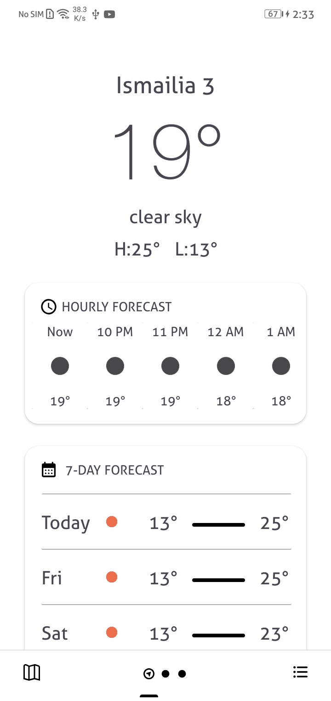
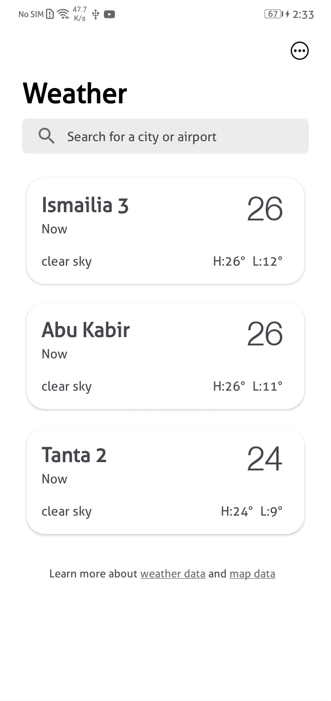
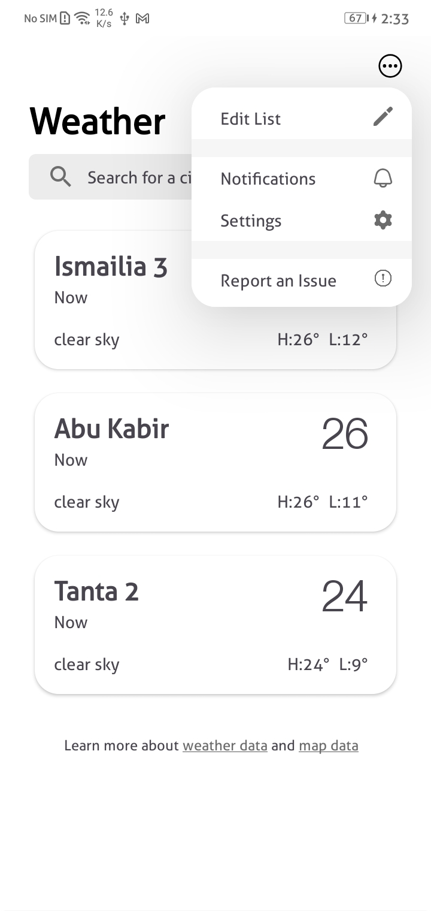
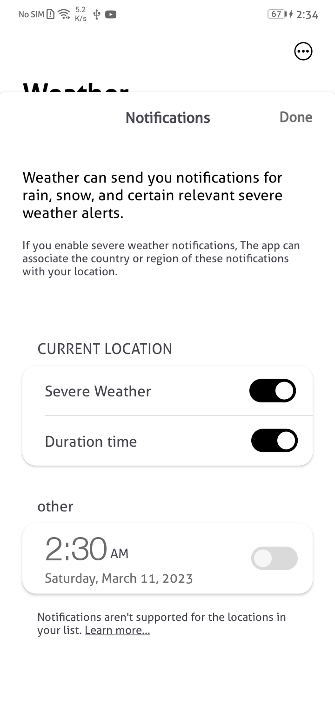
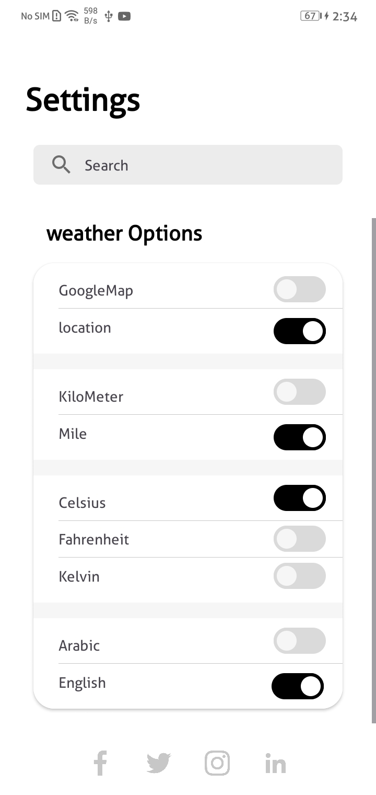
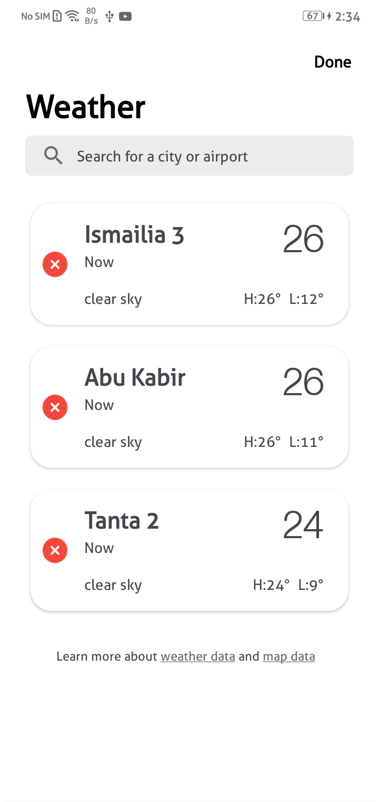

# Weather Application
Get the weather forecast in a beautiful and powerful app.
See current and forecasted weather with a smart layout that updates as conditions change.
And view precipitation, temperature to see different conditions near you.

## Features
*Settings Screen:
▪ In this screen the user will have the ability to choose the location and temperature units.
• For location: a user can choose even between getting the location by GPS or choosing a specific location from the map
• For units:
-User can choose units of temperature (Kelvin, Celsius, and Fahrenheit)
-User can choose units of wind speed (meter/sec, miles/hour.)
-User can choose language (Arabic – English)
 
*Home Screen:
This screen displays:
• The current temperature
• Current time
• Humidity
• Wind speed
• Clouds
• City
• Icon (suitable to the weather status)
• Weather description (clear sky, light rain ... etc.)
• All the past hourly for the current date
• All past features for 7 days.

*Weather Alerts Screen:
This screen will contain a button to add weather alert which should set an alarm
with the following settings:
▪ The duration through which the alarm is active.
▪ The type of alarm even using notification
▪ Option to stop notification or turn off the alarm.

*Favorite Screen:
This screen lists the favorite locations. Pressing on an item should open another
screen that displays all the forecast information of this place.
In addition, there should be a FAB button via which the user can add a new
favorite place. When it is clicked an activity whose map and auto-complete edit
text should be shown to give the user the ability to set a marker on a specific
location or type in the edit text the name of a city and save this location to the
favorites list.
Besides, facility to enable the user to remove a saved place.

## Technologies
- MVVM architectural design pattern.
- claen app architectur
- Retrofit API -> open weather api
- ROOM Database
- Google Maps
- Alarm manger
- Coroutines -> flow and channel
- Worker manger  -> periodic workmanager
- Test -> unit Testing 
- Data binding
- dagger hilt
- data store 

## "WeatherApp" Screens

     
     
     
     
     
     
