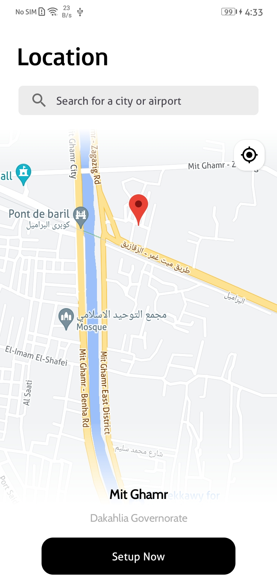
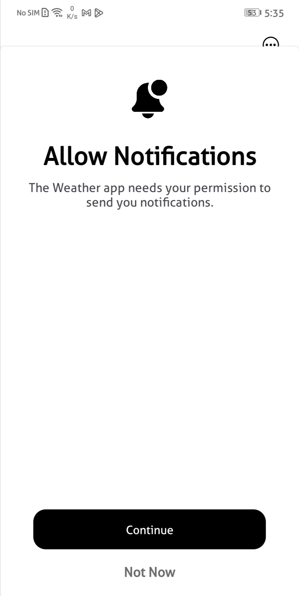

# Weather Application
Get the weather forecast in a beautiful and powerful app.
See current and forecasted weather with a smart layout that updates as conditions change.
And view precipitation, temperature to see different conditions near you.

## Features
### Settings Screen:
 &nbsp; • In this screen the user will have the ability to choose the location and temperature units.
 
 &nbsp; • For location: a user can choose even between getting the location by GPS or choosing a specific location from the map
 
  &nbsp; • For units:
   
  &nbsp; &nbsp; -User can choose units of temperature (Kelvin, Celsius, and Fahrenheit)
 
  &nbsp; &nbsp; -User can choose units of wind speed (meter/sec, miles/hour.)
 
  &nbsp; &nbsp; -User can choose language (Arabic – English)
 
### Home Screen:
This screen displays:
 
 &nbsp; • The current temperature
 
  &nbsp; • Current time
 
 &nbsp; • Humidity
 
 &nbsp; • Wind speed
 
 &nbsp; • Clouds
 
 &nbsp; • City
 
 &nbsp; • Icon (suitable to the weather status)
 
 &nbsp; • Weather description (clear sky, light rain ... etc.)
 
 &nbsp; • All the past hourly for the current date
 
 &nbsp; • All past features for 7 days.

### Weather Alerts Screen:
&nbsp; This screen will contain a button to add weather alert and set an alarm
 
&nbsp; with the following settings:
 
&nbsp; &nbsp; ▪ The duration through which the alarm is active.
 
&nbsp; &nbsp; ▪ The type of alarm even using notification
 
&nbsp; &nbsp; ▪ Option to stop notification or turn off the alarm.

### Favorite Screen:
This screen lists the favorite locations. Pressing on an open another
screen that displays all the forecast information of this place.
In addition, there is a FAB button via which the user can add a new
favorite place using auto complete search
Besides, facility to enable the user to remove a saved place.

## Technologies
- MVVM architectural pattern.
- clean app architectur
- Retrofit API 
- ROOM Database
- Google Maps, places services
- Navigation Component
- ViewModel
- Alarm manger
- Coroutines
- Worker manger
- Unit Testing 
- Data binding
- Dagger hilt
- Data store 

## "WeatherApp" Screens

     
     
     
     
     
     
     
